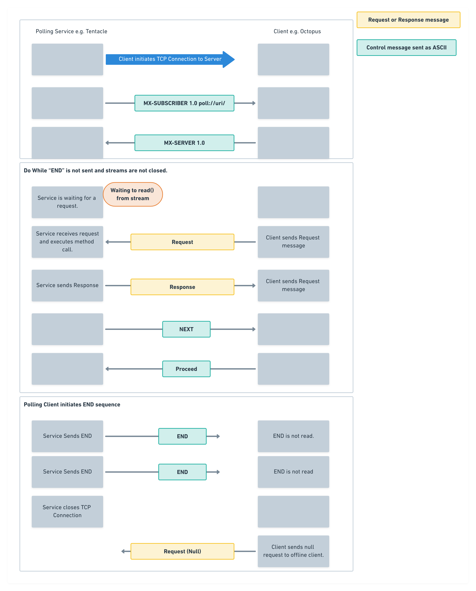
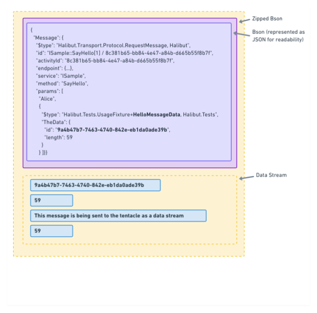
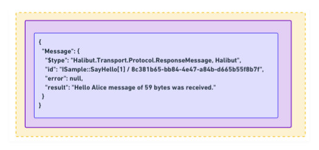

# Halibut Protocol data exchange

This document outlines the data that is exchanged between the **Client** and **Service**. In this document:

 - **Client** is what makes the remote procedure calls e.g. Octopus Server.
 - **Service** is what executes the methods e.g. Tentacle. 


When invoking a remote method in both polling and listening mode, the same general process is followed:

1.  After the TCP connection is intiated, both server and client identify themselves to each other through a set of control messages.
2. The Client sends a `Request` message containing the method to execute and data.
3. The Service executes the method and sends the result in a `Response` message.
4. The Service sends a `NEXT` control message, signaling it is ready for the next action.
5. The Client sends a `Proceed` control message, signaling to the Service to be ready for another `Request`.
6. Steps 2 to 5 are repeated until the connection is terminated or control `END` messages are sent.


## Listening Service protocol data exchange

When the **Service** is in  **Listening** mode, the **Client** it identifies itself as `MX-CLIENT 1.0` while the `Service` identifies itself as `MX-SERVER 1.0`.


## Polling Service protocol data exchange

When the **Service** is in  **Polling** mode, the **Service** identifies itself as `MX-SUBSCRIBER 1.0` while the `Client` identifies itself as `MX-SERVER 1.0`.



## Request and Response message format

The message format is always a Zipped BSON representation of either the [Request](../source/Halibut/Transport/Protocol/RequestMessage.cs) or [Response](../source/Halibut/Transport/Protocol/ResponseMessage.cs) message, followed by zero or more [DataStream]s(../source/Halibut/DataStream.cs). A `DataStream` represents data that should not be serialized as part of a message, for example a file to be transferred. They can be sent in either a request or a response. `DataStream`s are transferred as raw bytes in the TCP stream (i.e. they are not compressed) and are sent sequentially after the compressed BSON of the request/response. Each `DataStream` has a unique GUID which is referenced in the request/response so that it can be used by calling code.


### Example 

Below is an example of the Request and Response messages when making a simple RPC with Halibut.

For a RPC call made with
```
public interface ISample
{
    public string SayHello(string message, DataStream theData);
}

public class HelloMessageData
{
    public DataStream TheData { get; set; }
}

// Example call
var data = "This message is being sent to the tentacle as a data stream".ToUtf8();

var response = echo.SayHello("Alice", DataStream.FromBytes(data));
```

The resulting Request



The resulting response

